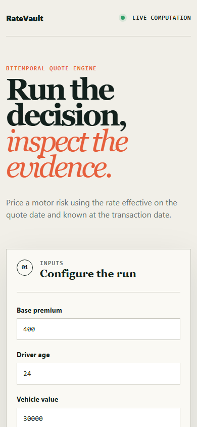

# ratevault

> A motor insurance quote engine with bitemporal rate tables, so any quote from the last two years reprices to the penny.

## Live deployment

[](https://github.com/SlateGitOrg/ratevault/actions/workflows/ci.yml)

[Open the working RateVault application](https://slategitorg.github.io/ratevault/)

This deployed application runs the project's decision workflow in the browser. Change the inputs, run the analysis, and inspect the computed metrics and decision trace.

### Desktop


### Mobile



`FLAGSHIP` · **Full Stack Engineering** · Expert · ~5-6 weeks · Insurance

**Primary language:** TypeScript
**Tags:** `bitemporal`, `postgres`, `range-types`, `determinism`, `sql`, `fintech`

---

## The problem

An insurer must be able to answer, two years later, 'why was this customer quoted 412 on 3 March?' - and reproduce it exactly, using the rate tables, rules and regulatory factors in force that day. Systems that mutate rate tables in place lose this forever, which turns a routine regulator query into a six-week forensic exercise and, occasionally, a fine.

## ⭐ The differentiator

**Bitemporal modelling**: every rate row carries a *valid-time* range (when the rate applied to the world) and a *transaction-time* range (when the system knew it). Reprice-as-of therefore answers two different questions - 'what did we quote' and 'what should we have quoted given a later backdated correction' - and can tell them apart. A generic version keeps a single `effective_date` column, silently conflates the two axes, and makes a backdated correction indistinguishable from the original pricing.

This is the sentence to lead with when someone asks you to walk through the
project. Everything else in this repo exists to make it true and to prove it.

## Data

A synthetic generator producing rate tables, factor curves and 100,000 quotes across 24 months, including **planted backdated corrections** whose correct pre- and post-correction prices are known ground truth. Factor structure is modelled on publicly documented motor rating variables.

> No paid API key is required to run or demo this project. Where a paid
> service would add value it is wired as an optional enhancement behind an
> interface with an offline mock as the default implementation.

## Stack

- TypeScript, NestJS
- PostgreSQL `tstzrange` with GiST exclusion constraints preventing overlapping validity
- Redis for quote-token idempotency
- Docker, GitHub Actions

## Core capabilities

- Bitemporal rate storage with exclusion constraints that make overlapping validity unrepresentable
- A deterministic rating pipeline - quote = f(risk, rate_version) with no ambient state and no clock reads inside the calculation
- Reprice-as-of API taking *both* time axes, returning a factor-by-factor diff explaining the price
- Rate-change staging with a portfolio-level simulation showing premium impact before publish
- Idempotent quote issuance keyed on a client-supplied token

## Repository layout

```
src/rating/               # pure, deterministic pricing functions
src/temporal/             # bitemporal query layer, as-of resolution
src/api/
db/migrations/            # range types + exclusion constraints
sim/                      # rate tables, quotes, planted corrections
test/reproducibility/     # replay all 100k quotes
test/property/
```

## Build plan

1. Model the bitemporal schema and get the exclusion constraints right before anything else.
2. Make the rating function pure. If it reads the clock or a global, reproducibility is already lost.
3. Replay harness: 100k quotes, byte-identical premiums. This is the headline test.
4. Add backdated corrections and prove the two time axes give different, correct answers.
5. Then the staging simulator and the API.

## Testing strategy

Replay all 100,000 historical quotes and assert **byte-identical premiums**. Property tests assert no overlapping valid-time range can be inserted for any (product, factor) pair - enforced by the database, attempted via raw SQL. A dedicated suite asserts that a backdated correction changes the 'what should we have quoted' answer while leaving 'what did we quote' untouched.

Tests assert **correctness**, not merely that the code runs. A green suite on
this repo is a claim about behaviour under adversarial conditions; treat any
test that would pass against a deliberately broken implementation as a bug in
the test.

## Quality & safety layer

Rate publication is a staged, audited operation with a mandatory impact simulation. Nothing mutates a rate row in place; corrections are new transaction-time versions.

## Measurable outcome

> Any quote from the last 24 months reproduces to the penny in under 200 ms, including quotes affected by backdated rate corrections.

State it in these terms — business units, not technical ones — in your CV
bullet and in the first thirty seconds of describing the project.

## Interview questions this project answers

- **Explain valid time versus transaction time, and give me a case where conflating them is a regulatory problem.**
- **How do you guarantee a pricing function is deterministic?**
- **How would you migrate a live system from uni-temporal to bitemporal?**

## What this deliberately is *not*

- Not an actuarial pricing model. The rating maths is deliberately simple; the temporal correctness is the project.
- Not a rules engine. Rules are data, versioned like everything else.


## Run it now

```bash
npm test        # runs the suite; no install step needed
npm run demo    # the 60-second artefact
```

Requires Node 22.6+ (24 recommended). TypeScript runs natively via
type stripping - there is no build step and no `node_modules`.

## Getting started

```bash
git clone <your-fork-url> ratevault
cd ratevault
docker compose up -d
npm install
npm run db:migrate
npm run sim                   # 24 months of rates + 100k quotes
npm run test:reproducibility  # the headline number
npm run start:dev
```

Docker is supported but optional — every path above works on a plain
Windows/macOS/Linux laptop without a cloud account.

## Definition of done

- [ ] The differentiator above is implemented, and a test proves it
- [ ] The measurable outcome is produced by a command anyone can run
- [ ] `README` explains the one decision a generic version gets wrong
- [ ] CI runs the full suite on every push and is green on `main`
- [ ] A recruiter can see the headline artefact in under 60 seconds

## Licence

MIT — see [LICENSE](LICENSE).
